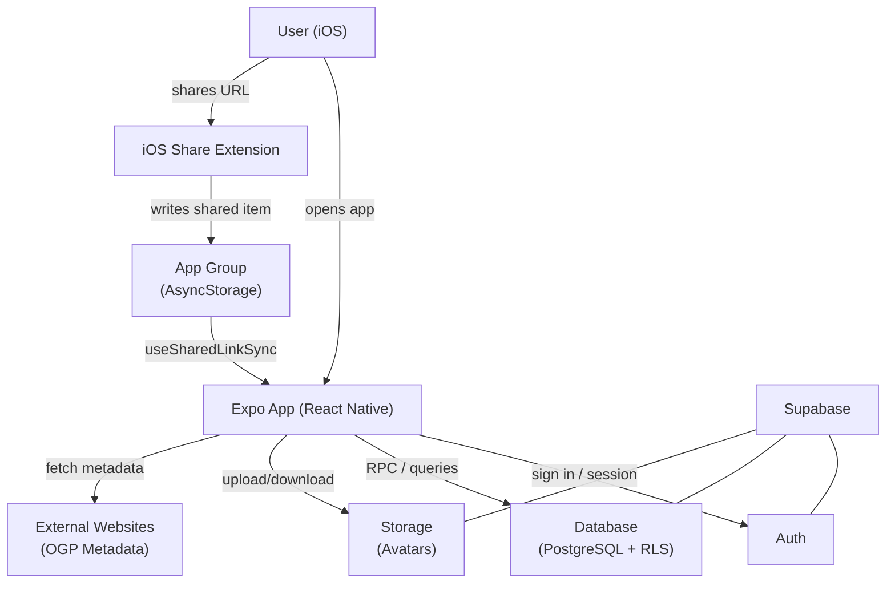
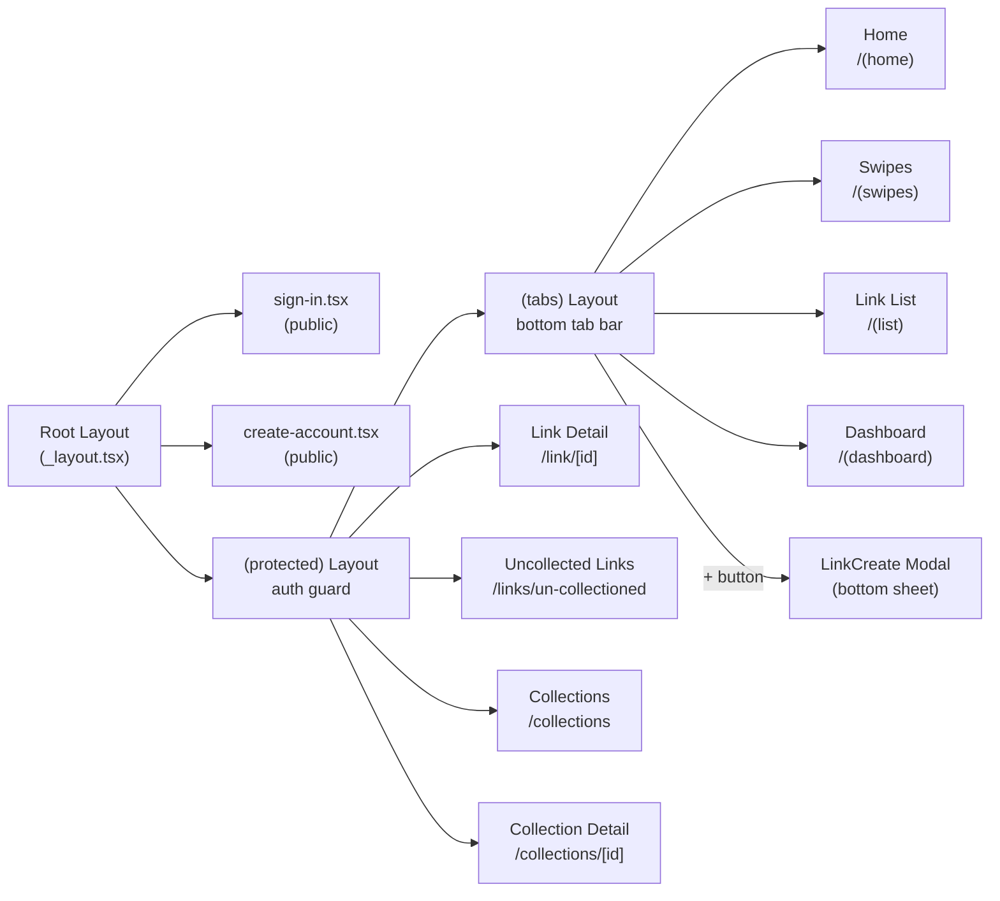
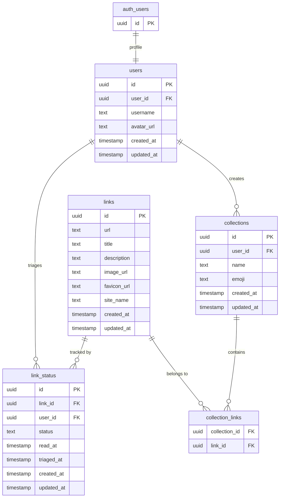
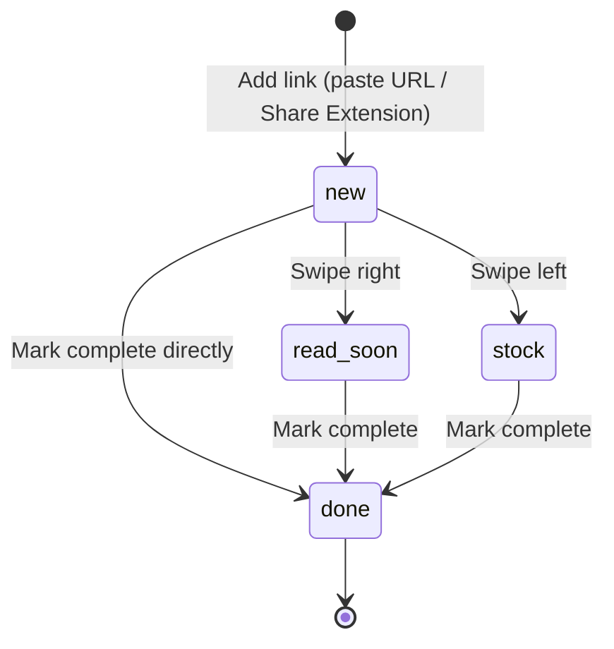
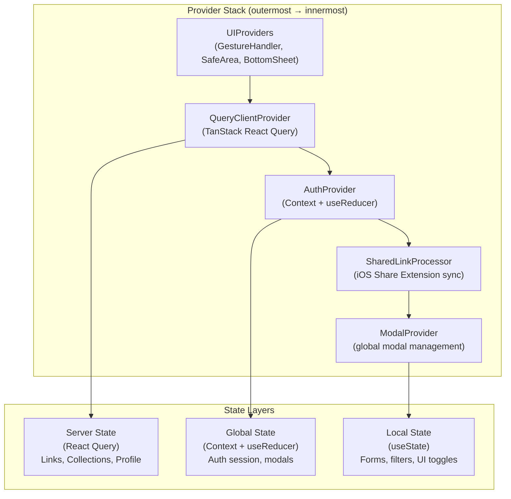

# linkcache

A **Knowledge Triage & Growth Space** app built with Expo (React Native).
Quickly save links and organize them through a **Swipe UI**: Inbox → Read Soon / Stock → Completed.

---

## Features

- Add links via URL paste with automatic OGP metadata fetching
- Swipe-based triage (Inbox → Read Soon / Stock → Completed)
- Collections for organizing saved links
- Link detail view with status tracking and read history
- Authentication via Supabase Auth (email/password + OAuth)
- iOS Share Extension — capture links directly from any app

---

## Tech Stack

| Category        | Technology                          |
| --------------- | ----------------------------------- |
| Framework       | Expo (Managed Workflow)             |
| Language        | TypeScript (Strict Mode)            |
| Routing         | Expo Router (file-based)            |
| Server State    | TanStack React Query                |
| Backend / Auth  | Supabase (Database, Auth, Storage)  |
| Validation      | Zod                                 |
| Styling         | NativeWind v4 (Tailwind CSS)        |
| Testing         | Jest + React Native Testing Library |
| Package Manager | pnpm                                |

---

## Setup

### 1. Install dependencies

```bash
pnpm install
```

### 2. Configure environment variables

Copy the example file and fill in your Supabase credentials:

```bash
cp .env.example .env.local
```

Required keys:

- `EXPO_PUBLIC_SUPABASE_URL`
- `EXPO_PUBLIC_SUPABASE_ANON_KEY`

Optional:

- `APP_ENV=dev` — switches bundle identifier and URL scheme to the development variant

### 3. Start the app

```bash
pnpm expo start
```

---

## Development Commands

| Command           | Description                                              |
| ----------------- | -------------------------------------------------------- |
| `pnpm expo start` | Start the Expo dev server                                |
| `pnpm test`       | Run the test suite                                       |
| `pnpm typecheck`  | TypeScript type check                                    |
| `pnpm lint`       | ESLint                                                   |
| `pnpm run check`  | format:fix + lint + typecheck + test (full verification) |

---

## Architecture

### System Overview



### Screen Navigation



### Database Schema



> `link_status.status` values: `new` | `read_soon` | `stock` | `done`

### Link Triage State Machine



### State Management Layers



---

## Directory Structure

```text
.
├── app/                        # Expo Router file-based routes
│   ├── _layout.tsx             # Root layout with all providers
│   ├── sign-in.tsx             # Public sign-in screen
│   ├── create-account.tsx      # Public sign-up screen
│   └── (protected)/            # Auth-guarded routes
│       ├── _layout.tsx         # Auth guard (redirects if not signed in)
│       ├── (tabs)/             # Bottom tab navigation (4 tabs)
│       │   ├── (home)/         # Home screen
│       │   ├── (swipes)/       # Swipe triage screen
│       │   ├── (list)/         # Link list screen
│       │   └── (dashboard)/    # Dashboard / stats
│       ├── link/[id].tsx       # Link detail (dynamic route)
│       ├── links/              # Uncollected links sub-routes
│       └── collections/        # Collection list + detail sub-routes
│
├── src/
│   ├── features/               # Business logic, organized by feature
│   │   ├── auth/               # Authentication (sign-in, sign-up, OAuth, session)
│   │   ├── links/              # Link management, swipe triage, collections (core feature)
│   │   ├── users/              # User profile and settings
│   │   └── share-extension/    # iOS Share Extension integration
│   │
│   └── shared/                 # Shared infrastructure
│       ├── components/         # Reusable UI components
│       ├── providers/          # App-level providers (Auth, Query, Modal, UI)
│       ├── hooks/              # Shared hooks (useDebounce, useDateTime, etc.)
│       ├── lib/                # Supabase client (with expo-secure-store session)
│       ├── utils/              # i18n, toast, timezone, file utilities
│       └── constants/          # Colors, locales, languages
│
├── supabase/
│   └── migrations/             # SQL migration files (Supabase RPC functions, views)
│
├── plugins/
│   └── withShareExtension.ts   # Custom Expo plugin for iOS Share Extension
│
└── targets/                    # iOS Share Extension native target
```

Each feature follows this internal structure:

```text
features/<name>/
├── api/          # Supabase/API calls (never called directly from UI)
├── hooks/        # React Query hooks wrapping the API layer
├── components/   # Feature-specific UI components
├── screens/      # Full screen compositions
├── types/        # TypeScript types and Zod schemas
└── __tests__/    # Tests (Classical TDD: Jest + RNTL)
```

---

## Notes

- **iOS Share Extension**: Configuration is in `app.config.js` and `plugins/withShareExtension.ts`. The extension communicates with the main app via an App Group.
- **Build variants**: `APP_ENV=dev` switches the bundle identifier and URL scheme, so be careful when running production builds locally.
- **Session storage**: Supabase sessions are persisted securely via `expo-secure-store` (not AsyncStorage).
- **React Query tuning**: `staleTime: 30min`, `gcTime: 60min`, `refetchOnWindowFocus: false` — optimized to minimize Supabase egress on mobile.
