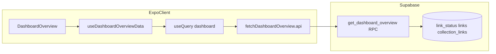

# ダッシュボード概要：API 層実装と UI 修正の実施事項

## 背景

MVP では「Growth Dashboard」と「Activity Log（直近 7 日）」を通じて、トリアージしたリンクを**実績として可視化**し、受動的な保存から能動的な整理へ寄せることが目的である（プロダクト方針：confidence-driven、決断疲れの低減）。

一方、現状の `DashboardOverview` は画面・フック・チャート／内訳 UI の骨格はあるが、**週次系列や日別内訳の一部がモックやクライアント側の仮計算に依存**している。また `useLinks` の件数上限などにより、**集計の母集団がユーザー全体のリンクを表さない**可能性がある。これでは「自分の進み具合」を信頼して見られず、ダッシュボードの価値が損なわれる。

そこで本プランでは、**Supabase 側で定義した集計仕様（日付の意味・重複計上の扱い・ドメイン対象など）に沿った RPC／ビュー**へ寄せ、**`api/` + React Query** で実データを取得し、モック依存を撤去する。また、失敗時の表示や引っ張り更新など、本番利用に耐える **UI 上の欠け**を埋める。

このドキュメントは、その実装に入る前の**現状整理・仕様の固定・実施チェックリスト**をリポジトリ内で共有するためのものである。コード変更そのものは別タスクで行う。

---

## ユーザーストーリー（何を実装したいか）

MVP の「Growth Dashboard／Activity Log」と、トリアージ後の振り返り体験を、**自分の実データ**で支えることがゴールである。

| 誰として                                           | 何がしたいか                                                                                          | なぜか（価値）                                                                                                                           |
| -------------------------------------------------- | ----------------------------------------------------------------------------------------------------- | ---------------------------------------------------------------------------------------------------------------------------------------- |
| **リンクを保存・トリアージしているユーザー**として | 直近 7 日の「追加したリンク数」と「読了（完了）したリンク数」を、**グラフで正しく**見たい             | モックではなく実績を見て、「今週どれだけ処理したか」を把握し、**決断疲れを減らす自信**（プロダクト哲学の confidence-driven）につなげたい |
| 同上                                               | ある日の棒を選んだとき、その日の内訳を**コレクション別**・**ドメイン別**で見たい                      | 「どのテーマ／どのサイトから情報が増えているか」を把握し、次の行動（読む順・整理）を決めやすくしたい                                     |
| 同上                                               | コレクション一覧の「追加／読了」の内訳が、**実際の `link_status` 等に基づく**数字であることを期待する | 一覧の件数とダッシュボードの話が食い違わず、**信頼できるダッシュボード**として使いたい                                                   |
| 同上                                               | 通信やサーバが失敗したとき、**何が起きたか分かり、再試行**できる                                      | 真っ白や無言の失敗ではなく、復帰の導線がほしい（レジリエンス）                                                                           |
| 同上                                               | 画面を**引っ張って更新**し、さきほどトリアージした結果がグラフに反映されることを確認したい            | 操作直後のフィードバックで「アプリが生きている」感覚を得たい                                                                             |

上記を満たすために、本ドキュメント以下のセクションでは **Supabase 集計（1 回の RPC 等）**、**`api/` + React Query**、**モック／仮計算の撤去**、**エラー UI と RefreshControl** を実施事項として列挙する。

---

## 0. 参照スキル・ルール（実装・レビュー時）

| 参照先                                                                                             | 用途                                                              |
| -------------------------------------------------------------------------------------------------- | ----------------------------------------------------------------- |
| [native-data-fetching](../../.cursor/skills/native-data-fetching/SKILL.md)                         | React Query、`expo/fetch` 方針                                    |
| [building-native-ui](../../.cursor/skills/building-native-ui/SKILL.md)                             | ScrollView／safe area／アニメーション（本リポは NativeWind 併用） |
| [vercel-react-native-skills](../../.cursor/skills/vercel-react-native-skills/SKILL.md)             | リスト・レンダリング・UI パターン                                 |
| [supabase-postgres-best-practices](../../.cursor/skills/supabase-postgres-best-practices/SKILL.md) | クエリ性能・RLS・接続・スキーマ（**セクション 3 で展開**）        |
| [cursor-rules.mdc](../../.cursor/rules/cursor-rules.mdc)                                           | Zod、feature/`api/` 集約、TDD                                     |

Supabase 周りは、SKILL 本文に加え `.cursor/skills/supabase-postgres-best-practices/references/` 以下の個別ルールを実装前に開くこと。

---

## 1. 現状調査サマリ（コードベース）

- **画面** — [`src/features/links/screens/DashboardOverview.tsx`](../../src/features/links/screens/DashboardOverview.tsx): `useDashboardOverviewData` と `useDashboardOverviewUi` でチャート／内訳を表示。`collectionsLoading || domainsLoading` のときのみスケルトン。**エラー UI なし**。
- **データ** — [`src/features/links/hooks/useDashboardOverviewData.ts`](../../src/features/links/hooks/useDashboardOverviewData.ts): **実データ**は `useCollections`（RPC `get_user_collections`）と `useLinks({ limit: 500 })`。**モック**は [`mockAddedByDay` / `mockReadByDay`](../../src/features/links/utils/dashboardStats.ts)。**合成**はコレクション／ドメインの `readCount` を `Math.floor(n * 0.45)` とする仮計算、日別内訳はモック日計を `splitDayTotalAcrossBuckets` で均等配分。
- **UI ロジック** — [`useDashboardOverviewUi.tsx`](../../src/features/links/hooks/useDashboardOverviewUi.tsx) および `useDashboardChartUi` / `useDashboardBreakdownUi`: 入力は `DashboardOverviewData` 形状に依存。データ差し替えで大部分は流用可。
- **ルート** — [`app/(protected)/(tabs)/(dashboard)/dashboard.tsx`](<../../app/(protected)/(tabs)/(dashboard)/dashboard.tsx>): `ScreenContainer` + `DashboardOverview`。

**解釈**: 「API のみ」ではなく、**週次系列・日別バケット・読了比率が未接続（モック／仮計算）**であり、`useLinks` の 500 件上限によるドメイン集計は**母集団を代表しない**可能性がある。

---

## 2. プロダクト定義（確定）

MVP の「Activity Log（直近 7 日）」および内訳表示について、DB・RPC の集計キーは次で固定する。

- **「追加（added）」の日付**: **`link_status.created_at`**（Inbox 追加＝ユーザーがそのリンクを自分のキューに載せた日時）。チャートの「追加」系列、および「追加」件数として扱う集計はすべてこれに基づく。
- **「完了／読了（read）」の日付**: **`read_at` の日付**（`read_at IS NOT NULL` の行について、`read_at` で日単位にバケット化）。保存は `timestamptz` とし、**画面上の「日」**はアプリ側でユーザーのローカルタイムゾーンに合わせて丸める（DB 集計と表示のタイムゾーンルールを RPC 設計時に一文で揃える）。
- **コレクション内訳と重複計上**: **内訳テーブル**（コレクション別の行・および日×コレクションの内訳）に限り、同一リンクが複数コレクションに属する場合は**コレクションごとに 1 回ずつ計上する（重複計上する）**。チャート上部の**日次合計**（全体の `added` / `read` 本数）は**リンクを一意に数え**、コレクション所属の重複で二重に増やさない。
- **ドメイン内訳の母集団**: **全ステータスではない**。**`triage_status` が `new`（ユーザー向けの「added」＝Inbox）または `done` のリンクのみ**を対象とする。`read_soon`・`stock` はドメイン内訳の集計から除外する。

---

## 3. バックエンド（Supabase）実施事項

[supabase-postgres-best-practices SKILL](../../.cursor/skills/supabase-postgres-best-practices/SKILL.md)の**優先度カテゴリ**に沿って設計・レビューする。ダッシュボードは読み取り集計が中心のため、特に **Query Performance**、**Security & RLS**、**Connection Management**、**Schema Design** を最初に満たす。

### 3.1 カテゴリ別チェックリスト（SKILL 準拠）

1. **Query Performance（CRITICAL）** — 集計 SQL は `EXPLAIN (ANALYZE, BUFFERS)` で確認する。フルテーブルスキャンや不要なソートが出ないようにする。実装時の参照: [monitor-explain-analyze.md](../../.cursor/skills/supabase-postgres-best-practices/references/monitor-explain-analyze.md)、[query-missing-indexes.md](../../.cursor/skills/supabase-postgres-best-practices/references/query-missing-indexes.md)、[query-composite-indexes.md](../../.cursor/skills/supabase-postgres-best-practices/references/query-composite-indexes.md)、[query-partial-indexes.md](../../.cursor/skills/supabase-postgres-best-practices/references/query-partial-indexes.md)（ステータスや `read_at IS NOT NULL` など条件が固定なら部分インデックスを検討）。
2. **Connection Management（CRITICAL）** — ダッシュ表示のために**複数 RPC を連打しない**。可能なら**1 回の RPC（または 1 クエリ）**でチャート用日次合計＋内訳に必要な行をまとめて返し、モバイルからの往復を減らす。参照: [conn-pooling.md](../../.cursor/skills/supabase-postgres-best-practices/references/conn-pooling.md)、[data-n-plus-one.md](../../.cursor/skills/supabase-postgres-best-practices/references/data-n-plus-one.md)（アプリ側の N+1 も同様に避ける）。
3. **Security & RLS（CRITICAL）** — 新規テーブル／ビュー／RPC いずれも**RLS または同等の境界**を維持。RLS 式が重いと集計が遅くなるため、ポリシーとインデックスの両方を見る。参照: [security-rls-basics.md](../../.cursor/skills/supabase-postgres-best-practices/references/security-rls-basics.md)、[security-rls-performance.md](../../.cursor/skills/supabase-postgres-best-practices/references/security-rls-performance.md)、[security-privileges.md](../../.cursor/skills/supabase-postgres-best-practices/references/security-privileges.md)。`SECURITY DEFINER` を使う場合は **search_path 固定・最小権限・対象列の限定**を徹底する（SKILL の Supabase 注記に合わせる）。
4. **Schema Design（HIGH）** — 外部キー側インデックス、適切な型（日付は `timestamptz`）、不要な JSON 肥大化を避ける。参照: [schema-foreign-key-indexes.md](../../.cursor/skills/supabase-postgres-best-practices/references/schema-foreign-key-indexes.md)、[schema-data-types.md](../../.cursor/skills/supabase-postgres-best-practices/references/schema-data-types.md)。
5. **Concurrency & Locking（MEDIUM-HIGH）** — 集計は主に読み取りだが、マイグレーションやメンテ時は短いトランザクションに留める。参照: [lock-short-transactions.md](../../.cursor/skills/supabase-postgres-best-practices/references/lock-short-transactions.md)。
6. **Data Access Patterns（MEDIUM）** — 内訳行が多い場合は**カーソル／キーセット型ページング**を検討（ダッシュ MVP では 7 日×限定的バケットなら不要なことも多い）。参照: [data-pagination.md](../../.cursor/skills/supabase-postgres-best-practices/references/data-pagination.md)。
7. **Monitoring & Diagnostics（LOW–MEDIUM）** — 本番前後で `pg_stat_statements` やプランの再確認。参照: [monitor-pg-stat-statements.md](../../.cursor/skills/supabase-postgres-best-practices/references/monitor-pg-stat-statements.md)。

### 3.2 機能要件

- **ユーザー境界**: 既存方針どおり `profiles` 経由の設計・RLS と整合させる。
- **集計の置き場**: 日別 × コレクション／ドメインの行列は、クライアントで 500 件 `get_user_links` から再現せず **Postgres 集計（VIEW または RPC）** に寄せる。
- **推奨アウトプット形（例）**
  - `daily_totals`: 直近 7 日の `{ date, added_count, read_count }[]`（チャート用）
  - `daily_by_collection`: 同期間・コレクション別（フラット行またはクライアントがピボットしやすい形）
  - `daily_by_domain`: ドメイン抽出ルールを SQL 関数化し、アプリの [`extractDomain`](../../src/features/links/utils/urlUtils.ts) と同値になるようテスト／ドキュメントで固定。**対象行は §2 のとおり `new` と `done` のみ**
- **インデックス（初期候補）**: 仕様で決めた「追加日」「読了日」に対応する `(user_id, date_trunc(...))` や `(user_id, created_at)`、`read_at` 条件付きなど。**実際の `EXPLAIN` 結果で不足分を追加**する（机上の列挙だけにしない）。

---

## 4. API レイヤー（`src/features/links/api/`）実施事項

[`.cursor/rules/cursor-rules.mdc`](../../.cursor/rules/cursor-rules.mdc)、[native-data-fetching SKILL](../../.cursor/skills/native-data-fetching/SKILL.md)、[react-native-expo-architecture.mdc](../../.cursor/rules/react-native-expo-architecture.mdc)に従う。

- **新規ファイル例**: `fetchDashboardOverview.api.ts`（または週次／サマリに分割する場合は 2 ファイル。YAGNI のため開始は 1 ファイルで可）。
- **責務**: `supabase.rpc(...)` または `.from(...).select(...)` のみ。認証ガード（未ログインは throw）は既存 [`fetchCollections.api.ts`](../../src/features/links/api/fetchCollections.api.ts) と同パターン。
- **Zod**: RPC／ビュー戻り値を**スキーマで parse**し、失敗時は明示的エラー（プロジェクト既存の `safeParse` + メッセージ流れに合わせる）。
- **エラー**: `response.error` / HTTP 相当の失敗は throw し、React Query の `isError` に載せる（SKILL の `if (!response.ok) throw` パターンと同趣旨）。

---

## 5. React Query（キー・フック）実施事項

[`src/features/links/constants/queryKeys.ts`](../../src/features/links/constants/queryKeys.ts)を拡張。

- **`linkQueryKeys`（または `dashboardQueryKeys`）**に `overview` 用キーを追加（例: `['links','dashboard','overview', { range: '7d' }]`）。パラメータ化するなら日付範囲をキーに含める。
- **専用フック**（例: `useDashboardOverviewQuery`）: `useQuery` で上記 API を呼ぶ。`staleTime`／`retry` は SKILL の推奨を踏襲（ダッシュボードは数分 `staleTime` でも可）。
- **無効化（invalidate）**: リンク作成・ステータス変更・既読更新・コレクション紐付け変更の **mutation `onSuccess` / `onSettled`** でダッシュボードキーを `invalidateQueries`。既存の `linkQueryKeys` / `collectionQueryKeys` 無効化箇所を一覧し、漏れを防ぐ。

---

## 6. `useDashboardOverviewData` の置き換え

- **削除対象**: `mockAddedByDay` / `mockReadByDay` 依存、`splitDayTotalAcrossBuckets` による仮日別行列（サーバから実行列が来るなら）。
- **コレクションサマリ**: `itemsCount` + 仮 `readCount` をやめ、**RPC が返す added/read** に置換。コレクション一覧自体は引き続き `useCollections` でよいが、**同じ画面で二重フェッチになる**場合は RPC 一本化を検討（トレードオフをドキュメント化）。
- **ドメイン**: RPC のドメイン集計に寄せ、**§2 の母集団（`new` / `done` のみ）**を SQL で再現する。クライアント [`buildDomainStatsFromLinks`](../../src/features/links/utils/dashboardStats.ts) は削除またはフォールバック廃止を検討。
- **ローディング合成**: 現状は `collectionsLoading || domainsLoading` のみ。ダッシュ専用クエリを足すなら **`dashboardLoading` を OR** するか、`useQueries` でまとめて `isPending` を集約。

---

## 7. UI 修正（画面・コンテナ）

参照: [building-native-ui SKILL](../../.cursor/skills/building-native-ui/SKILL.md)（ScrollView / safe area / アニメーション）、[vercel-react-native-skills SKILL](../../.cursor/skills/vercel-react-native-skills/SKILL.md)（フォールバック・リスト・画像）、プロジェクトルール（NativeWind `className`）。

**注意**: building-native-ui 本文に「Tailwind 非対応」とあるが、本リポジトリは **NativeWind v3**（[cursor-rules.mdc](../../.cursor/rules/cursor-rules.mdc)）が正。スタイルは**既存の `className` パターンを維持**する。

実施候補:

1. **エラー状態**: `useDashboardOverviewData`（または新フック）から `isError` / `error` を返し、[`DashboardOverview.tsx`](../../src/features/links/screens/DashboardOverview.tsx)で**再試行ボタン付きの簡潔なエラー UI**（SKILL の `if (error) return <Error />` パターン）。部分失敗（コレクション OK・ダッシュ NG）ならセクション単位のエラー表示も検討。
2. **引っ張り更新**: [`ScreenContainer`](../../src/shared/components/layout/ScreenContainer.tsx)は `ScrollView` だが `RefreshControl` 未接続。**ダッシュ画面だけ** `refreshing` / `onRefresh` を渡せるよう `ScreenContainer` にオプションを足すか、ダッシュルートで `ScrollView` を上書きするかを選択（変更範囲最小なら props 拡張）。
3. **空データ**: 7 日とも 0 件のときのチャート／テーブルの**空表示コピー**（既存コンポーネントに props があれば活用）。
4. **アクセシビリティ**: チャート側に既存の `chart.accessibility` があるため、エラー／空状態にも**ラベル**を付与（意味のある状態を読み上げ可能にする）。
5. **パフォーマンス**: 日別行列が大きくなった場合、内訳テーブルは [vercel-react-native-skills](../../.cursor/skills/vercel-react-native-skills/SKILL.md)の**仮想化（FlashList 等）**を検討（現状行数が少なければ後回しで可／YAGNI）。

---

## 8. テスト（`cursor-rules` TDD）

- **API 層**: 既存パターンに倣い [`src/features/links/__tests__/api/`](../../src/features/links/__tests__/api/)に Zod 成功／失敗・認証エラーのテスト。
- **フック／ユーティリティ**: [`dashboardOverview.fixtures`](../../src/features/links/testing/dashboardOverview.fixtures.ts)を**実 RPC 形状に合わせて更新**。`useDashboardChartUi` / `useDashboardBreakdownUi` の既存テストを維持。
- **結合**: 可能なら MSW／Supabase mock は最小限（ルールの「外部プロセスのみモック」に合わせる）。

---

## 9. データフロー（実装後イメージ）

---

## 10. このドキュメントについて

- 冒頭の「背景」に本プランの目的と現状課題をまとめた。以降はプラン「ダッシュボード概要：API 層実装と UI 修正の実施事項」に基づき、リポジトリ用にリンクを整備した版である。
- 実装タスクに着手する際は、セクション 2 の仕様（確定）→ セクション 3 の DB/RPC → 4〜8 の順が安全。
