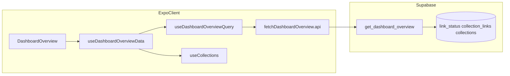

# US-B: Growth Dashboard コレクション内訳（`daily_by_collection` / collection_table）

**ストーリー**: ユーザーとして、週次チャートで日を選んだとき（および日未選択時の一覧）に、**コレクション別**の追加／読了内訳を **RPC `get_dashboard_overview` の `daily_by_collection`** に基づいて見たい。ドメイン別内訳（`daily_by_domain`）は本ストーリーでは **引き続きモック**（**US-C**）。チャートの 7 日合計（`daily_totals`）は **US-A 済み**のまま変更しない。

一次情報: [dashboard-overview-api.md](./dashboard-overview-api.md) · ストーリー対応: [dashboard-overview-user-stories-execution-plan.md](./dashboard-overview-user-stories-execution-plan.md) · 先行完了: [dashboard-overview-us-a.md](./dashboard-overview-us-a.md)

**ストーリーステータス — US-B 未完了（実行計画確定）**: 下記 **B1 → B7** の DoD および [§8 Story DoD](#8-ストーリー完了定義story-dod) を満たした時点でストーリー完了とする。完了後は本書の [§5](#5-実装サマリb1b7・着手後に更新) を [dashboard-overview-us-a.md §5](./dashboard-overview-us-a.md#5-実装済みt1t9サマリ) と同様に「実装済みパス」へ差し替える。**US-X**（エラー UI・RefreshControl 等）は引き続き別ストーリー。

| 項目                                 | 内容                                                                   |
| ------------------------------------ | ---------------------------------------------------------------------- |
| **推奨実行順**                       | 下記 **B1 → B7**（依存があるため順序を崩さない）                       |
| **1 タスクあたりの完了定義**         | 各タスク末尾の **DoD** を満たすこと                                    |
| **スプリント完了（ストーリー DoD）** | [§8 ストーリー完了定義](#8-ストーリー完了定義story-dod)                |
| **B1〜B7 実装**                      | **未着手**（完了後は §5・§6 のチェックを埋め、ステータス行を更新する） |

---

## 1. スコープ / 非スコープ

| IN                                                                                                                                                                                                          | OUT                                                                                 |
| ----------------------------------------------------------------------------------------------------------------------------------------------------------------------------------------------------------- | ----------------------------------------------------------------------------------- |
| RPC の **`daily_by_collection`** を実装し、**内訳テーブル**（`tableView === "collection"`）の日別・一覧用データをサーバ集計に置き換える                                                                     | **`daily_by_domain`** の実データ・SQL とアプリ `extractDomain` の同値（**US-C**）   |
| [§2 コレクション重複計上](dashboard-overview-api.md#2-プロダクト定義方針--db-突合せ後に-rpc-で確定)（内訳のみ複数コレクションで重複）と、チャート **`daily_totals`＝リンク一意**の整合                      | チャート系列ロジックの変更（**US-A 確定分を壊さない**）                             |
| `collectionStats` の **`itemsCount` / 仮 `readCount`（`Math.floor(n * 0.45)`）撤去**し、**直近 7 日**の RPC 由来 added/read に置換（[§6](dashboard-overview-api.md#6-usedashboardoverviewdata-の置き換え)） | ドメインの `domainStats` / 日別行列のモック撤去（**US-C**）                         |
| `api/` Zod 厳格化・`useDashboardOverviewData` のコレクション行列合成・**コレクション内訳の loading 合成**（[§6・§7](dashboard-overview-api.md)）                                                            | エラー UI・再試行・**RefreshControl**（**US-X**）                                   |
| 古典派 TDD（red → green）と **`pnpm run check`**                                                                                                                                                            | `EXPLAIN (ANALYZE, BUFFERS)` の本番相当検証（データ量に応じたフォローアップ・任意） |

---

## 2. 事前読了（着手前）

1. [§1.1 現行スキーマ](dashboard-overview-api.md#11-現行スキーママイグレーション実装rpc-設計前の突合せ)
2. [§2 プロダクト定義](dashboard-overview-api.md#2-プロダクト定義方針--db-突合せ後に-rpc-で確定)（特に **コレクション内訳の重複計上**・日付・`p_tz`）
3. [§3.1 カテゴリ別チェックリスト](dashboard-overview-api.md#31-カテゴリ別チェックリストskill-準拠)（単一 RPC・RLS・インデックス）
4. [§6 `useDashboardOverviewData` の置き換え](dashboard-overview-api.md#6-usedashboardoverviewdata-の置き換え)・[§10 層の安全順](dashboard-overview-api.md#10-このドキュメントについて)
5. [dashboard-overview-us-a.md §3（RPC 契約・`daily_totals`）](./dashboard-overview-us-a.md#3-rpc-契約確定参照)

参照 Skills: [native-data-fetching](../../.cursor/skills/native-data-fetching/SKILL.md)、[supabase-postgres-best-practices](../../.cursor/skills/supabase-postgres-best-practices/SKILL.md)、[vercel-react-native-skills](../../.cursor/skills/vercel-react-native-skills/SKILL.md)、[building-native-ui](../../.cursor/skills/building-native-ui/SKILL.md)。

参照ルール: [react-native-expo-architecture.mdc](../../.cursor/rules/react-native-expo-architecture.mdc)（feature / `api/` 集約）、[simplicity-first-design.mdc](../../.cursor/rules/simplicity-first-design.mdc)（ドメイン側モック継続の過剰抽象化を避ける）。

---

## 3. RPC 契約（US-B 拡張分）

**前提**: 関数名・認証・`daily_totals`・`daily_by_domain === []` は [US-A §3](./dashboard-overview-us-a.md#3-rpc-契約確定参照) と同一。US-B は **`daily_by_collection` のみ**を空配列から実データへ拡張する（**新規マイグレーション**で `CREATE OR REPLACE FUNCTION`）。

**集計の正本**: [dashboard-overview-api.md §2](./dashboard-overview-api.md#2-プロダクト定義方針--db-突合せ後に-rpc-で確定)。

| 項目                      | 内容                                                                                                                                                                                                                                                                                                              |
| ------------------------- | ----------------------------------------------------------------------------------------------------------------------------------------------------------------------------------------------------------------------------------------------------------------------------------------------------------------- |
| `daily_totals`            | **変更しない**（7 日・リンク一意・`created_at` / `read_at` 暦日・`p_tz`）                                                                                                                                                                                                                                         |
| `daily_by_domain`         | **`[]` のまま**（US-C）                                                                                                                                                                                                                                                                                           |
| `daily_by_collection`     | 直近 **7 日**（**index 0 ＝ 6 日前**、**6 ＝ 今日**）のコレクション別 added/read。日境界・タイムゾーンは `daily_totals` と同じ窓・式に合わせる                                                                                                                                                                    |
| 重複計上                  | **内訳のみ**: 同一 `link` が複数コレクションに属する場合、**コレクションごとに** added/read を計上。チャート上の日次合計は `daily_totals` が正で、内訳行の合計がその日のチャート棒と一致する必要はない（§2）                                                                                                      |
| added / read の意味       | **added**: `link_status.created_at` を `p_tz` で暦日化し、そのリンクが当該コレクションに属する行としてカウント（`collection_links` 等で結合）。**read**: `read_at IS NOT NULL` を同様に暦日化しコレクション別にカウント                                                                                           |
| **JSON 形状（確定・B1）** | **`daily_by_collection`**: フラット配列 `{ date, collection_id, added_count, read_count }[]`。`date` は `YYYY-MM-DD`（`daily_totals` と同じ暦日）。`collection_id` は **UUID 文字列**。`added_count` / `read_count` は非負整数。**疎行列**: 両方 0 の `(日, コレクション)` 行は返さない（B4 で 0 埋めピボット）。 |

---

## 4. DB マイグレーション（B1）

- **現状（US-A）**: [`20260322000000_get_dashboard_overview.sql`](../../supabase/migrations/20260322000000_get_dashboard_overview.sql) で `daily_by_collection` は `'[]'::json`（のち [`20260322032918`](../../supabase/migrations/20260322032918_dashboard_overview_seven_day_timestamp_filter.sql) で `daily_totals` のみ更新）。
- **US-B B1（実装済み）**: [`20260322074231_get_dashboard_overview_daily_by_collection.sql`](../../supabase/migrations/20260322074231_get_dashboard_overview_daily_by_collection.sql) で `get_dashboard_overview` を置換し、`daily_by_collection` を §3 どおり生成。`idx_collection_links_link_id`（`collection_links(link_id)`）を追加。
- **適用**: **Supabase MCP** の `apply_migration` を正とする（[AGENTS.md](../../AGENTS.md)）。CLI はフォールバック。

---

## 5. 実装サマリ（B1〜B7・着手後に更新）

**完了時の作業**: 下表を「実装済みパスで埋め、チェックを付ける」。[US-A §5](./dashboard-overview-us-a.md#5-実装済みt1t9サマリ) と同様に、代表ファイルリンクを正とする。

| 範囲              | 予定コード（代表）                                                                                                                                                                                                                                                                     |
| ----------------- | -------------------------------------------------------------------------------------------------------------------------------------------------------------------------------------------------------------------------------------------------------------------------------------- |
| B1（RPC）         | [`20260322074231_get_dashboard_overview_daily_by_collection.sql`](../../supabase/migrations/20260322074231_get_dashboard_overview_daily_by_collection.sql)（MCP 適用済み想定）                                                                                                         |
| B2（型）          | [`supabase.types.ts`](../../src/features/links/types/supabase.types.ts) の `get_dashboard_overview` 戻り                                                                                                                                                                               |
| B3（API）         | [`fetchDashboardOverview.api.ts`](../../src/features/links/api/fetchDashboardOverview.api.ts)、[`fetchDashboardOverview.api.test.ts`](../../src/features/links/__tests__/api/fetchDashboardOverview.api.test.ts)                                                                       |
| B4（データ合成）  | [`useDashboardOverviewData.ts`](../../src/features/links/hooks/useDashboardOverviewData.ts)、[`useDashboardOverviewData.test.ts`](../../src/features/links/__tests__/hooks/useDashboardOverviewData.test.ts) — コレクション行列・`collectionStats` を RPC 由来に。ドメインはモック継続 |
| B5（UI・loading） | [`useDashboardBreakdownUi.ts`](../../src/features/links/hooks/useDashboardBreakdownUi.ts) の `isTableLoading`（collection 時に `dashboardOverviewPending` を合成）、必要なら [`DashboardOverview.tsx`](../../src/features/links/screens/DashboardOverview.tsx)                         |
| B6（fixtures）    | [`dashboardOverview.fixtures.ts`](../../src/features/links/testing/dashboardOverview.fixtures.ts)、必要なら [`useDashboardBreakdownUi.test.ts`](../../src/features/links/__tests__/hooks/useDashboardBreakdownUi.test.ts)                                                              |
| B7（品質ゲート）  | `pnpm test` / `pnpm run check`、実機確認ログ                                                                                                                                                                                                                                           |

**不要（US-A 済）**: 新規 Query キー、`useDashboardOverviewQuery` の追加オプション、mutation からの `dashboardOverviewPrefix()` invalidate 追加。

---

## 6. 実行計画（タスク / サブタスク）

### データフロー（US-B 完了後の参照）



---

### B1 — Supabase: `daily_by_collection` を RPC に実装

|            |                                                                                                                                                        |
| ---------- | ------------------------------------------------------------------------------------------------------------------------------------------------------ |
| **目的**   | `get_dashboard_overview` の戻りで `daily_by_collection` を §3 の集計ルールどおり埋める。                                                               |
| **依存**   | §1.1 / §2 の突合せ済みであること                                                                                                                       |
| **成果物** | 新規マイグレーション（`CREATE OR REPLACE FUNCTION public.get_dashboard_overview`）。`daily_totals` の挙動を壊さない。`daily_by_domain` は `'[]'::json` |

- [ ] 7 日窓・`p_tz` 暦日が `daily_totals` と一致
- [ ] コレクション内訳のみ §2 の重複計上
- [ ] `SECURITY DEFINER`・`search_path`・認証エラー方針は既存 RPC と同パターン

**DoD**: 検証 DB で RPC を叩き、手元または SQL テストで期待 JSON になる。`daily_totals` の回帰なし。

---

### B2 — 型: `supabase.types.ts`

|            |                                                                                     |
| ---------- | ----------------------------------------------------------------------------------- |
| **目的**   | クライアント生成型を新 JSON に合わせる。                                            |
| **依存**   | B1                                                                                  |
| **成果物** | [`supabase.types.ts`](../../src/features/links/types/supabase.types.ts)（該当 RPC） |

- [ ] `get_dashboard_overview` の戻り型が実レスポンスと一致

**DoD**: 型エラーなく `supabase.rpc('get_dashboard_overview')` 呼び出し可能。

---

### B3 — API 層: Zod 厳格化 + テスト

|            |                                                                                                                                                                                                                  |
| ---------- | ---------------------------------------------------------------------------------------------------------------------------------------------------------------------------------------------------------------- |
| **目的**   | `daily_by_collection` を `z.array(z.unknown())` から **契約どおりのスキーマ**へ。失敗時は既存どおり throw。                                                                                                      |
| **依存**   | B2（型と Zod を齟齬なく）                                                                                                                                                                                        |
| **成果物** | [`fetchDashboardOverview.api.ts`](../../src/features/links/api/fetchDashboardOverview.api.ts)、[`fetchDashboardOverview.api.test.ts`](../../src/features/links/__tests__/api/fetchDashboardOverview.api.test.ts) |

- [ ] 成功パース・不正ペイロード拒否のテスト（red → green）
- [ ] `daily_totals` / `daily_by_domain` の既存検証を壊さない

**DoD**: API テストが緑。Zod が `daily_by_collection` の形を単一の正として表す。

---

### B4 — `useDashboardOverviewData`（コレクションのみ実データ化）

|            |                                                                                                                                                                                                                                                             |
| ---------- | ----------------------------------------------------------------------------------------------------------------------------------------------------------------------------------------------------------------------------------------------------------- |
| **目的**   | `collectionAddedStatsByDay` / `collectionReadStatsByDay` を RPC 由来に。`collectionStats` を **直近 7 日のコレクション別 added/read 合計**にし、仮 `readCount` を削除。ドメインは `mockAddedByDay` / `mockReadByDay` / `buildDomainStatsFromLinks` のまま。 |
| **依存**   | B3                                                                                                                                                                                                                                                          |
| **成果物** | [`useDashboardOverviewData.ts`](../../src/features/links/hooks/useDashboardOverviewData.ts)、[`useDashboardOverviewData.test.ts`](../../src/features/links/__tests__/hooks/useDashboardOverviewData.test.ts)                                                |

- [ ] `useCollections` の **id・並び**に合わせて行列をピボット（RPC にあって UI にないコレクション、逆パターンの扱いを決めテストで固定）
- [ ] ドメイン経路がモックのままであることをテストで明示（US-C 回帰防止）

**DoD**: フックテストで、固定 `daily_by_collection` に対する日別・`collectionStats` が仕様どおり。チャート系列（`daily_totals`）は従来どおり。

---

### B5 — 内訳 UI: コレクション loading 合成

|            |                                                                                                                                                                                                                                                                                                 |
| ---------- | ----------------------------------------------------------------------------------------------------------------------------------------------------------------------------------------------------------------------------------------------------------------------------------------------- |
| **目的**   | `tableView === "collection"` のとき、内訳が **ダッシュ RPC 未確定**で誤表示されない。                                                                                                                                                                                                           |
| **依存**   | B4（`DashboardOverviewData` に `dashboardOverviewPending` が既にある前提）                                                                                                                                                                                                                      |
| **成果物** | [`useDashboardBreakdownUi.ts`](../../src/features/links/hooks/useDashboardBreakdownUi.ts) の `isTableLoading` を **`collectionsLoading \|\| dashboardOverviewPending`** に更新（collection 時）。[`DashboardOverview.tsx`](../../src/features/links/screens/DashboardOverview.tsx) は要否を確認 |

- [ ] ドメイン表示時は従来どおり `domainsLoading` のみ（または仕様どおり維持）

**DoD**: コレクションタブでダッシュ pending 中はテーブルが loading 扱い。実機で確認。

---

### B6 — テスト・フィクスチャ

|            |                                                                                                                                                                                                                                                                   |
| ---------- | ----------------------------------------------------------------------------------------------------------------------------------------------------------------------------------------------------------------------------------------------------------------- |
| **目的**   | B4〜B5 の振る舞いを fixtures 込みで固定する。                                                                                                                                                                                                                     |
| **依存**   | B4（B5 と並行可）                                                                                                                                                                                                                                                 |
| **成果物** | [`dashboardOverview.fixtures.ts`](../../src/features/links/testing/dashboardOverview.fixtures.ts) に `daily_by_collection` 付き最小データ。必要なら [`useDashboardBreakdownUi.test.ts`](../../src/features/links/__tests__/hooks/useDashboardBreakdownUi.test.ts) |

- [ ] `createMinimalOverviewData` 等が型・テストで一貫

**DoD**: 関連テストが緑。

---

### B7 — 回帰テスト・品質ゲート

|            |                                |
| ---------- | ------------------------------ |
| **目的**   | ストーリー全体の品質を締める。 |
| **依存**   | B3〜B6 完了                    |
| **成果物** | ローカル確認ログ               |

- [ ] `pnpm test`
- [ ] `pnpm run check`
- [ ] 実機またはシミュレータ: 日未選択のコレクション一覧ソート・日選択後の内訳が RPC と矛盾しないこと

**DoD**: `pnpm run check` 通過。テストが緑。

---

## 7. 影響ファイル一覧（参照）

| 種別                    | パス・備考                                                                                                                                                        |
| ----------------------- | ----------------------------------------------------------------------------------------------------------------------------------------------------------------- |
| **主に変更（予定）**    | 新規マイグレーション、`supabase.types.ts`、`fetchDashboardOverview.api.ts`、`useDashboardOverviewData.ts`、`useDashboardBreakdownUi.ts`、各 `__tests__`・fixtures |
| **参照のみ（US-A 済）** | `useDashboardOverviewQuery.ts`、`queryKeys.ts`、mutation 9 本の invalidate、チャート系コンポーネント                                                              |
| **残（US-C）**          | `daily_by_domain`、ドメイン行列、`extractDomain` SQL 同値                                                                                                         |
| **残（US-X）**          | [dashboard-overview-api.md §7](dashboard-overview-api.md#7-ui-修正画面コンテナ)（エラー UI・RefreshControl 等）                                                   |

---

## 8. ストーリー完了定義（Story DoD）

[dashboard-overview-user-stories-execution-plan.md § 完了定義](./dashboard-overview-user-stories-execution-plan.md#完了定義dod) の **US-B** に準拠:

- コレクション内訳の **重複計上**と、チャート **`daily_totals`（リンク一意）** の関係が [§2](dashboard-overview-api.md#2-プロダクト定義方針--db-突合せ後に-rpc-で確定) どおり説明・テストできること。
- **`pnpm run check` が通る**こと。
- 実務上は **B1〜B7 の DoD をすべて満たす**ことと同等。

---

## 9. US-C への引き継ぎ

- **`daily_by_domain`** を RPC で埋め、ドメイン日別行列と `domainStats` をサーバ集計へ移す（[dashboard-overview-api.md §3.2](dashboard-overview-api.md#32-機能要件)、[実行プラン US-C](./dashboard-overview-user-stories-execution-plan.md)）。
- `buildDomainStatsFromLinks` および `useLinks({ limit: 500 })` 依存の撤去は **US-C** で判断。

---

## 10. 検証コマンド

```bash
pnpm run check
pnpm test
```

---

## 改訂履歴（メモ）

| 日付       | 内容                                        |
| ---------- | ------------------------------------------- |
| 2026-03-22 | 初版（US-B 垂直分割タスクのドキュメント化） |
