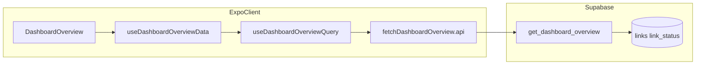

# US-C: Growth Dashboard ドメイン内訳（`daily_by_domain` / domain_table）

**ストーリー**: ユーザーとして、週次チャートで日を選んだとき（および日未選択時の一覧）に、**ドメイン別**の追加／読了内訳を **RPC `get_dashboard_overview` の `daily_by_domain`** に基づいて見たい。集計の母集団・日境界・ドメイン文字列の意味は [dashboard-overview-api.md §2・§3.2](./dashboard-overview-api.md) が正本である。**チャート**（`daily_totals`）および **コレクション内訳**（`daily_by_collection`）は **US-A / US-B 済み**の挙動を壊さない。

一次情報: [dashboard-overview-api.md](./dashboard-overview-api.md) · ストーリー対応: [dashboard-overview-user-stories-execution-plan.md](./dashboard-overview-user-stories-execution-plan.md) · 先行完了: [dashboard-overview-us-a.md](./dashboard-overview-us-a.md)、[dashboard-overview-us-b.md](./dashboard-overview-us-b.md)

**ストーリーステータス — US-C 完了**: **C1〜C7 完了**（§5・§6 参照）。**US-X**（エラー UI・RefreshControl 等）は別ストーリー。

| 項目                                 | 内容                                                    |
| ------------------------------------ | ------------------------------------------------------- |
| **推奨実行順**                       | 下記 **C1 → C7**（依存があるため順序を崩さない）        |
| **1 タスクあたりの完了定義**         | 各タスク末尾の **DoD** を満たすこと                     |
| **スプリント完了（ストーリー DoD）** | [§8 ストーリー完了定義](#8-ストーリー完了定義story-dod) |
| **C1〜C7 実装**                      | **C1〜C7 済**（§5・§6 を随時更新）                      |

**開発原則**（垂直スライス・TDD・品質ゲート）: [dashboard-overview-user-stories-execution-plan.md § 開発原則](./dashboard-overview-user-stories-execution-plan.md#開発原則) に従う。各タスクは **red → green → refactor** と **`pnpm run check`** を回してから次へ進める。

---

## 1. スコープ / 非スコープ

| IN                                                                                                                                                                                                                                                                                                                            | OUT                                                                                                                                     |
| ----------------------------------------------------------------------------------------------------------------------------------------------------------------------------------------------------------------------------------------------------------------------------------------------------------------------------- | --------------------------------------------------------------------------------------------------------------------------------------- |
| RPC の **`daily_by_domain`** を実装し、**内訳テーブル**（`tableView === "domain"`）の日別・一覧用データをサーバ集計に置き換える                                                                                                                                                                                               | **コレクション内訳**の集計ルール変更・`daily_by_collection` の形状変更（**US-B 確定分を壊さない**）                                     |
| [§2 ドメイン母集団](dashboard-overview-api.md#2-プロダクト定義方針--db-突合せ後に-rpc-で確定)（**`daily_totals` と同一の added/read 母集団**）を SQL で再現する                                                                                                                                                               | `daily_totals` とドメイン内訳で added/read の定義を食い違わせること                                                                     |
| [`extractDomain`](../../src/features/links/utils/urlUtils.ts) と **同じ URL に対して同じドメイン文字列**になる SQL 抽出（[§3.2 同値性・検証手順](dashboard-overview-api.md#32-機能要件)）                                                                                                                                     | 別 RPC への分割・ダッシュ用の複数往復（[§3.1](dashboard-overview-api.md#31-カテゴリ別チェックリストskill-準拠) と矛盾する場合はしない） |
| [§3.3 レスポンスサイズ](dashboard-overview-api.md#33-性能ダッシュボードモバイルで追加で押さえる点)に沿い、**上位 N ドメイン＋「その他」** など RPC 側で上限を決める（N は実装時に確定し、本書 §3 に追記する）                                                                                                                 | 無制限ドメイン行の JSON 返却                                                                                                            |
| `api/` Zod 厳格化・[`useDashboardOverviewData`](../../src/features/links/hooks/useDashboardOverviewData.ts) のドメイン行列・`domainStats` の RPC 化・**ドメインタブの loading 合成**（[§6](dashboard-overview-api.md#6-usedashboardoverviewdata-の置き換え)、本書 C4〜C5）                                                    | エラー UI・再試行・**RefreshControl**（**US-X**）                                                                                       |
| **`useLinks({ limit: 500 })` をダッシュのドメイン集計から撤去**、`mockAddedByDay` / `mockReadByDay` / `splitDayTotalAcrossBuckets` によるドメイン日別行列の撤去、[`buildDomainStatsFromLinks`](../../src/features/links/utils/dashboardStats.ts) のダッシュからの参照廃止（他画面で未使用なら関数・モック定数の削除まで検討） | チャート系列（`daily_totals`）のロジック変更                                                                                            |
| 古典派 TDD（red → green）と **`pnpm run check`**                                                                                                                                                                                                                                                                              | `EXPLAIN (ANALYZE, BUFFERS)` の本番相当検証（データ量に応じたフォローアップ・任意）                                                     |

---

## 2. 事前読了（着手前）

1. [§1.1 現行スキーマ](dashboard-overview-api.md#11-現行スキーママイグレーション実装rpc-設計前の突合せ)
2. [§2 プロダクト定義](dashboard-overview-api.md#2-プロダクト定義方針--db-突合せ後に-rpc-で確定)（**ドメイン母集団**・日付・`p_tz`・コレクション重複とドメインの違い）
3. [§3.1 カテゴリ別チェックリスト](dashboard-overview-api.md#31-カテゴリ別チェックリストskill-準拠)、[§3.2 機能要件（`daily_by_domain`・`extractDomain` 検証）](dashboard-overview-api.md#32-機能要件)、[§3.3 性能](dashboard-overview-api.md#33-性能ダッシュボードモバイルで追加で押さえる点)
4. [§6 `useDashboardOverviewData` の置き換え](dashboard-overview-api.md#6-usedashboardoverviewdata-の置き換え)・[§8 テスト](dashboard-overview-api.md#8-テストcursor-rules-tdd)・[§10 層の安全順](dashboard-overview-api.md#10-このドキュメントについて)
5. [dashboard-overview-us-b.md §3（`daily_by_collection` 契約・JSON 形状）](./dashboard-overview-us-b.md#3-rpc-契約us-b-拡張分)（ドメイン行の疎行列・日付形式の揃え方の参考）

参照 Skills: [native-data-fetching](../../.cursor/skills/native-data-fetching/SKILL.md)、[supabase-postgres-best-practices](../../.cursor/skills/supabase-postgres-best-practices/SKILL.md)、[vercel-react-native-skills](../../.cursor/skills/vercel-react-native-skills/SKILL.md)、[building-native-ui](../../.cursor/skills/building-native-ui/SKILL.md)。

参照ルール: [react-native-expo-architecture.mdc](../../.cursor/rules/react-native-expo-architecture.mdc)（feature / `api/` 集約）、[simplicity-first-design.mdc](../../.cursor/rules/simplicity-first-design.mdc)（上位 N＋その他以外の過剰一般化を避ける）。

---

<a id="us-c-rpc-contract"></a>

## 3. RPC 契約（US-C 拡張分）

**前提**: 関数名・認証・`daily_totals`・`daily_by_collection` は現行マイグレーション（例: [`20260322074231_get_dashboard_overview_daily_by_collection.sql`](../../supabase/migrations/20260322074231_get_dashboard_overview_daily_by_collection.sql)）どおり **変更しない**。US-C は **`daily_by_domain` のみ**を `'[]'::json` から本書の契約どおりの JSON に拡張する（`CREATE OR REPLACE FUNCTION public.get_dashboard_overview`）。

**集計の正本**: [dashboard-overview-api.md §2](./dashboard-overview-api.md#2-プロダクト定義方針--db-突合せ後に-rpc-で確定)。

| 項目                  | 内容                                                                                                                                                                                                                                                                           |
| --------------------- | ------------------------------------------------------------------------------------------------------------------------------------------------------------------------------------------------------------------------------------------------------------------------------ |
| `daily_totals`        | **変更しない**                                                                                                                                                                                                                                                                 |
| `daily_by_collection` | **変更しない**                                                                                                                                                                                                                                                                 |
| `daily_by_domain`     | 直近 **7 日**（**index 0 ＝ 6 日前**、**6 ＝ 今日**）のドメイン別 added/read。日境界・タイムゾーン・窓の predicate は `daily_totals` と**同一**（[`20260322032918`](../../supabase/migrations/20260322032918_dashboard_overview_seven_day_timestamp_filter.sql) 系と整合）     |
| 母集団                | **`daily_totals` と同一**（`link_status` 全ステータス。added は `created_at`、read は `read_at IS NOT NULL` が窓内の行）。§2 参照                                                                                                                                              |
| added / read の意味   | **added**: その母集団で `created_at` を `p_tz` で暦日化した日バケットでカウント。**read**: 同母集団で `read_at` を `p_tz` で暦日化してカウント（`daily_totals` の read 系列と一致）                                                                                            |
| ドメインキー          | `links.url`（またはビュー経由の同等列）から抽出し、**`extractDomain` と同じ文字列**（空文字は不正 URL 等に対応）。検証は [§3.2](dashboard-overview-api.md#32-機能要件) のベクトル手順に従う                                                                                    |
| 上位 N ＋その他       | [§3.3](dashboard-overview-api.md#33-性能ダッシュボードモバイルで追加で押さえる点) に従い、**7 日間の合計活動量**（`added_count + read_count` の行和）でドメインをランクし、**上位 N ＝ 15** を個別キーとして残し、それ以外を **`__other__`** に日別 rollup する（C1 実装済み） |
| **JSON 形状（案）**   | フラット配列 `{ date, domain, added_count, read_count }[]`。`date` は `YYYY-MM-DD`（`daily_totals` と同じ暦日）。`domain` は **テキスト**（「その他」バケットもこの文字列で識別）。`added_count` / `read_count` は非負整数。**疎行列**: 両方 0 の行は返さない                  |

**クライアント側のバケット順**: コレクションと異なり `useCollections` の並びは使わない。実装では **7 日分の RPC 行からドメイン一覧を導出**し、一覧表示・ピボットの列順を **直近 7 日の合計活動量降順**（現行 `buildDomainStatsFromLinks` のソート意図に近い）など、仕様として一文固定する（C4 の DoD に含める）。

---

<a id="us-c-c1-migration"></a>

## 4. DB マイグレーション（C1）

- **現状（US-B まで）**: [`20260322074231_get_dashboard_overview_daily_by_collection.sql`](../../supabase/migrations/20260322074231_get_dashboard_overview_daily_by_collection.sql) の戻りで `'daily_by_domain', '[]'::json`（スタブ）。
- **US-C C1（実装済み）**: [`20260322103614_get_dashboard_overview_daily_by_domain.sql`](../../supabase/migrations/20260322103614_get_dashboard_overview_daily_by_domain.sql) — `public.extract_domain_for_dashboard(text)`（`IMMUTABLE`）＋`get_dashboard_overview` 置換、`idx_link_status_dashboard_domain_added` / `idx_link_status_dashboard_domain_read`（部分インデックス）。リモート適用は **Supabase MCP `apply_migration`**（記録名 `get_dashboard_overview_daily_by_domain`）。
- **母集団整合（追補）**: [`20260323120000_dashboard_overview_domain_align_totals.sql`](../../supabase/migrations/20260323120000_dashboard_overview_domain_align_totals.sql) — `daily_by_domain` の added/read を `daily_totals` と同じ `link_status` 母集団に揃え、上記部分インデックスを `DROP`（`idx_link_status_user_id_created_at` / `idx_link_status_user_id_read_at_not_null` を利用）。
- **適用**: **Supabase MCP** の `apply_migration` を正とする（[AGENTS.md](../../AGENTS.md)）。CLI はフォールバック。
- **インデックス**: 整合後はドメイン CTE が `(user_id, created_at)` / `read_at` の汎用インデックスを主に利用。データ量に応じて `EXPLAIN (ANALYZE, BUFFERS)` で §3.1 を再確認する。

---

## 5. 実装サマリ（C1〜C7・着手後に更新）

**完了時の作業**: 下表を「実装済みパスで埋め、チェックを付ける」。[US-B §5](./dashboard-overview-us-b.md#5-実装サマリb1b7着手後に更新) と同様に、代表ファイルリンクを正とする。

| 範囲              | 状態 | 予定コード（代表）                                                                                                                                                                                                                                                                                                                                                                                      |
| ----------------- | ---- | ------------------------------------------------------------------------------------------------------------------------------------------------------------------------------------------------------------------------------------------------------------------------------------------------------------------------------------------------------------------------------------------------------- |
| C1（RPC）         | ✅   | [`20260322103614_get_dashboard_overview_daily_by_domain.sql`](../../supabase/migrations/20260322103614_get_dashboard_overview_daily_by_domain.sql) ＋ [`20260323120000_dashboard_overview_domain_align_totals.sql`](../../supabase/migrations/20260323120000_dashboard_overview_domain_align_totals.sql) — `extract_domain_for_dashboard`、`daily_by_domain`、N=15・`__other__`、母集団＝`daily_totals` |
| C2（型）          | ✅   | [`supabase.types.ts`](../../src/features/links/types/supabase.types.ts) の `DashboardOverviewRpcJson.daily_by_domain` 行型                                                                                                                                                                                                                                                                              |
| C3（API）         | ✅   | [`fetchDashboardOverview.api.ts`](../../src/features/links/api/fetchDashboardOverview.api.ts)、[`fetchDashboardOverview.api.test.ts`](../../src/features/links/__tests__/api/fetchDashboardOverview.api.test.ts) — `daily_by_domain` 行の Zod 厳格化（`dashboardDailyByDomainRowSchema`）                                                                                                               |
| C4（データ合成）  | ✅   | [`useDashboardOverviewData.ts`](../../src/features/links/hooks/useDashboardOverviewData.ts)、[`useDashboardOverviewData.test.ts`](../../src/features/links/__tests__/hooks/useDashboardOverviewData.test.ts) — ドメイン行列・`domainStats` を RPC ピボット、`useLinks` 撤去、モック行列撤去                                                                                                             |
| C5（UI・loading） | ✅   | [`useDashboardBreakdownUi.ts`](../../src/features/links/hooks/useDashboardBreakdownUi.ts)、[`useDashboardBreakdownUi.loading.test.ts`](../../src/features/links/__tests__/hooks/useDashboardBreakdownUi.loading.test.ts) 等 — ドメインタブで `dashboardOverviewPending` を合成（US-B B5 と対称）                                                                                                        |
| C6（fixtures）    | ✅   | [`dashboardOverview.fixtures.ts`](../../src/features/links/testing/dashboardOverview.fixtures.ts)、[`dashboardOverview.fixtures.test.ts`](../../src/features/links/testing/__tests__/dashboardOverview.fixtures.test.ts) — `daily_by_domain` を含む RPC フィクスチャと Zod 整合（`dashboardOverviewWithDomainBreakdownRpcFixture` をスキーマ検証）                                                      |
| C7（品質ゲート）  | ✅   | `pnpm test` / `pnpm run check` 通過（2026-03-22 実施）                                                                                                                                                                                                                                                                                                                                                  |

**不要（US-A / US-B 済）**: 新規 Query キー、`useDashboardOverviewQuery` のシグネチャ拡張（同一 RPC のままなら）、mutation からの `dashboardOverviewPrefix()` invalidate の追加（新規 mutation がなければ不要）。

**共有ベクトル（C1 / C3 と連携）**: [§3.2](dashboard-overview-api.md#32-機能要件) に従い、URL → 期待ドメインの配列をリポジトリに 1 箇所に置き、Jest で `extractDomain` を検証し、SQL 側は同一期待値で検証する（ファイル例: [`src/features/links/utils/__tests__/extractDomain.vectors.ts`](../../src/features/links/utils/__tests__/extractDomain.vectors.ts) — 実装時に作成）。

---

<a id="us-c-execution-plan"></a>

## 6. 実行計画（タスク / サブタスク）

### データフロー（US-C 完了後の目標像）



ドメイン内訳は **ダッシュ RPC 1 回**で `daily_by_domain` まで取得し、コレクション一覧メタは引き続き [`useCollections`](../../src/features/links/hooks/useCollections.ts)（US-B と同様、二重フェッチのトレードオフは [dashboard-overview-api.md §6](dashboard-overview-api.md#6-usedashboardoverviewdata-の置き換え) の方針どおり）。

---

### C1 — Supabase: `daily_by_domain` を RPC に実装

|            |                                                                                                                                                                                |
| ---------- | ------------------------------------------------------------------------------------------------------------------------------------------------------------------------------ |
| **目的**   | `get_dashboard_overview` の戻りで `daily_by_domain` を §3 の集計ルールどおり埋める。                                                                                           |
| **依存**   | §1.1 / §2 / §3.2 の突合せ済みであること                                                                                                                                        |
| **成果物** | 新規マイグレーション（`CREATE OR REPLACE FUNCTION public.get_dashboard_overview`）。`daily_totals` と `daily_by_collection` の挙動を壊さない。ドメイン抽出関数＋上位 N＋その他 |

- [x] 7 日窓・`p_tz` 暦日が `daily_totals` と一致
- [x] 母集団が §2（`daily_totals` と同一・`link_status` 全 `triage_status`）
- [x] `SECURITY DEFINER`・`search_path`・認証エラー方針は既存 RPC と同パターン
- [x] §3.2 の代表ベクトルは SQL で `extract_domain_for_dashboard` を検証可能（例: `example.com` / `localhost` / `a.example.com` / `''`）

**DoD**: 検証 DB で RPC を叩き、期待 JSON 形状・母集団・境界日が仕様どおり。US-A/US-B の回帰なし。

---

### C2 — 型: `supabase.types.ts`

|            |                                                                                     |
| ---------- | ----------------------------------------------------------------------------------- |
| **目的**   | クライアント生成型を新 JSON に合わせる。                                            |
| **依存**   | C1                                                                                  |
| **成果物** | [`supabase.types.ts`](../../src/features/links/types/supabase.types.ts)（該当 RPC） |

- [x] `get_dashboard_overview` の戻り型が実レスポンスと一致（`DashboardOverviewRpcJson`）

**DoD**: 型エラーなく `supabase.rpc('get_dashboard_overview')` 呼び出し可能。

---

### C3 — API 層: Zod 厳格化 + テスト

|            |                                                                                                                                                                                                                  |
| ---------- | ---------------------------------------------------------------------------------------------------------------------------------------------------------------------------------------------------------------- |
| **目的**   | `daily_by_domain` を `z.array(z.unknown())` から **契約どおりのスキーマ**へ。失敗時は既存どおり throw。                                                                                                          |
| **依存**   | C2（型と Zod を齟齬なく）                                                                                                                                                                                        |
| **成果物** | [`fetchDashboardOverview.api.ts`](../../src/features/links/api/fetchDashboardOverview.api.ts)、[`fetchDashboardOverview.api.test.ts`](../../src/features/links/__tests__/api/fetchDashboardOverview.api.test.ts) |

- [x] 成功パース・不正ペイロード拒否のテスト（red → green）
- [x] `daily_totals` / `daily_by_collection` の既存検証を壊さない

**DoD**: API テストが緑。Zod が `daily_by_domain` の形を単一の正として表す。

---

### C4 — `useDashboardOverviewData`（ドメインを実データ化）

|            |                                                                                                                                                                                                                                                                                                                              |
| ---------- | ---------------------------------------------------------------------------------------------------------------------------------------------------------------------------------------------------------------------------------------------------------------------------------------------------------------------------- |
| **目的**   | `domainAddedStatsByDay` / `domainReadStatsByDay` / `domainStats` を **`daily_by_domain` のピボット**に置換する。`useLinks({ limit: 500 })`、`buildDomainStatsFromLinks`、`mockAddedByDay` / `mockReadByDay` / `splitDayTotalAcrossBuckets` のドメイン経路を削除する。コレクション経路は **US-B どおり RPC のまま**維持する。 |
| **依存**   | C3                                                                                                                                                                                                                                                                                                                           |
| **成果物** | [`useDashboardOverviewData.ts`](../../src/features/links/hooks/useDashboardOverviewData.ts)、[`useDashboardOverviewData.test.ts`](../../src/features/links/__tests__/hooks/useDashboardOverviewData.test.ts)                                                                                                                 |

- [x] `effectiveSevenDayDates`（既存）とドメインバケット列で 7×ドメインの added/read 行列を 0 埋めできる
- [x] `DashboardOverviewData` から **`domainsLoading` を削除**（型で寄せ切り済み）
- [x] コレクション RPC ピボットのテストを壊さない
- [x] 空ドメイン・「その他」バケット・i18n の unknown ラベル（表示名）の扱いをテストまたはコメントで固定

**DoD**: フックテストで、固定 `daily_by_domain` に対する日別・`domainStats` が仕様どおり。チャート・コレクション系列は従来どおり。

---

### C5 — 内訳 UI: ドメイン loading 合成（US-B B5 と対称）

|            |                                                                                                                                                                                                                                                                                                                                                  |
| ---------- | ------------------------------------------------------------------------------------------------------------------------------------------------------------------------------------------------------------------------------------------------------------------------------------------------------------------------------------------------ |
| **目的**   | `tableView === "domain"` のとき、内訳が **ダッシュ RPC 未確定**で誤表示されない。                                                                                                                                                                                                                                                                |
| **依存**   | C4（`dashboardOverviewPending` がデータに載る前提）                                                                                                                                                                                                                                                                                              |
| **成果物** | [`useDashboardBreakdownUi.ts`](../../src/features/links/hooks/useDashboardBreakdownUi.ts)、[`useDashboardBreakdownUi.loading.test.ts`](../../src/features/links/__tests__/hooks/useDashboardBreakdownUi.loading.test.ts)、必要なら [`useDashboardBreakdownUi.test.ts`](../../src/features/links/__tests__/hooks/useDashboardBreakdownUi.test.ts) |

- [x] `isTableLoading` を **ドメインタブで `dashboardOverviewPending` を含む**形に更新（コレクションタブは従来どおり `collectionsLoading \|\| dashboardOverviewPending`）
- [x] `domainsLoading` 分岐を除去済み

**DoD**: ドメインタブでダッシュ pending 中はテーブルが loading 扱い。`pnpm test` / `pnpm run check` 通過。

---

### C6 — テスト・フィクスチャ

|            |                                                                                                                                                                                                                          |
| ---------- | ------------------------------------------------------------------------------------------------------------------------------------------------------------------------------------------------------------------------ |
| **目的**   | C4〜C5 の振る舞いを fixtures 込みで固定する。                                                                                                                                                                            |
| **依存**   | C4（C5 と並行可）                                                                                                                                                                                                        |
| **成果物** | [`dashboardOverview.fixtures.ts`](../../src/features/links/testing/dashboardOverview.fixtures.ts)、[`dashboardOverview.fixtures.test.ts`](../../src/features/links/testing/__tests__/dashboardOverview.fixtures.test.ts) |

- [x] RPC フィクスチャ `dashboardOverviewWithDomainBreakdownRpcFixture` を `dashboardOverviewRpcSchema` で検証（`createMinimalOverviewData` は画面合成形状のまま）

**DoD**: 関連テストが緑。

---

### C7 — 回帰テスト・品質ゲート

|            |                                |
| ---------- | ------------------------------ |
| **目的**   | ストーリー全体の品質を締める。 |
| **依存**   | C3〜C6 完了                    |
| **成果物** | ローカル確認ログ               |

- [x] `pnpm test`
- [x] `pnpm run check`
- [ ] 任意: 実機またはシミュレータでドメインタブ・日未選択一覧・日選択内訳が RPC と矛盾しないこと

**DoD**: `pnpm run check` 通過。テストが緑。

---

## 7. 影響ファイル一覧（参照）

| 種別                           | パス・備考                                                                                                                                                                                                                                                                                                                                                                                                                                     |
| ------------------------------ | ---------------------------------------------------------------------------------------------------------------------------------------------------------------------------------------------------------------------------------------------------------------------------------------------------------------------------------------------------------------------------------------------------------------------------------------------- |
| **主に変更（予定）**           | 新規 `supabase/migrations/*.sql`、`supabase.types.ts`、`fetchDashboardOverview.api.ts`、関連 API テスト、`useDashboardOverviewData.ts`、関連フックテスト、`useDashboardBreakdownUi.ts`、`useDashboardBreakdownUi.loading.test.ts`、`dashboardOverview.fixtures.ts`、`dashboardOverview.fixtures.test.ts`、共有 URL ベクトル（§3.2）、[`dashboardStats.ts`](../../src/features/links/utils/dashboardStats.ts)（未使用化したモック・関数の整理） |
| **参照のみ（US-A / US-B 済）** | `useDashboardOverviewQuery.ts`、`queryKeys.ts`、mutation invalidate、チャート・コレクション内訳の既存コンポーネント                                                                                                                                                                                                                                                                                                                            |
| **残（US-X）**                 | [dashboard-overview-api.md §7](dashboard-overview-api.md#7-ui-修正画面コンテナ)（エラー UI・RefreshControl 等）                                                                                                                                                                                                                                                                                                                                |

---

## 8. ストーリー完了定義（Story DoD）

[dashboard-overview-user-stories-execution-plan.md § 完了定義](./dashboard-overview-user-stories-execution-plan.md#完了定義dod) の **US-C** に準拠:

- ドメイン内訳の母集団が **`daily_totals` と同一**（`link_status` 全 `triage_status`）で、ドメイン抽出が **`extractDomain` と同値**であることを §3.2 の手順で説明・検証できること。
- ドメイン日別行列・`domainStats` が **`useLinks` 500 件上限やモック系列に依存しない**こと。
- **`pnpm run check` が通る**こと。
- 実務上は **C1〜C7 の DoD をすべて満たす**ことと同等。

---

## 9. US-X への引き継ぎ

- ダッシュ全体の **エラー UI・再試行・`RefreshControl`** は [dashboard-overview-api.md §7](./dashboard-overview-api.md#7-ui-修正画面コンテナ) および [実行プラン US-X](./dashboard-overview-user-stories-execution-plan.md) に委ねる（US-C では RPC 成功時の内訳正しさまでをスコープとする）。

---

## 10. 実装完了後に更新するドキュメント（メモ）

US-C ストーリーを完了扱いにするとき、次を同期すること（本書のみ更新しても実行プランと正本がずれる）。

- [dashboard-overview-user-stories-execution-plan.md](./dashboard-overview-user-stories-execution-plan.md) の US-C チェックリスト
- [dashboard-overview-api.md](./dashboard-overview-api.md) の進捗サマリ（冒頭）および §1・§3.2 実装状況表・§6 のドメイン記述

---

## 11. 検証コマンド

```bash
pnpm run check
pnpm test
```

---

## 改訂履歴（メモ）

| 日付       | 内容                                                                                                                                                                                                                |
| ---------- | ------------------------------------------------------------------------------------------------------------------------------------------------------------------------------------------------------------------- |
| 2026-03-22 | 初版（US-C 垂直分割タスクのドキュメント化）                                                                                                                                                                         |
| 2026-03-22 | §3・§4・§6 に HTML アンカー（`us-c-rpc-contract` 等）を追加し、[実行プラン](./dashboard-overview-user-stories-execution-plan.md)・[dashboard-overview-api.md](./dashboard-overview-api.md) からの相互リンク用に整理 |
| 2026-03-22 | **C1 完了**: `20260322103614_get_dashboard_overview_daily_by_domain.sql`、`extract_domain_for_dashboard`、N=15・`__other__`、部分インデックス；§3・§4・§5・§6・実行プランを同期                                     |
| 2026-03-22 | **C2・C3 完了**: `DashboardOverviewRpcJson.daily_by_domain` 行型、`dashboardDailyByDomainRowSchema` と API テスト；§5・§6・実行プラン・[dashboard-overview-api.md](./dashboard-overview-api.md) を同期              |
| 2026-03-22 | **C4〜C7 完了**: `useDashboardOverviewData` のドメイン RPC ピボット、内訳 loading 合成、`dashboardOverviewWithDomainBreakdownRpcFixture` の Zod テスト追加、品質ゲート；§5・§6・実行プラン・api 正本を同期          |
