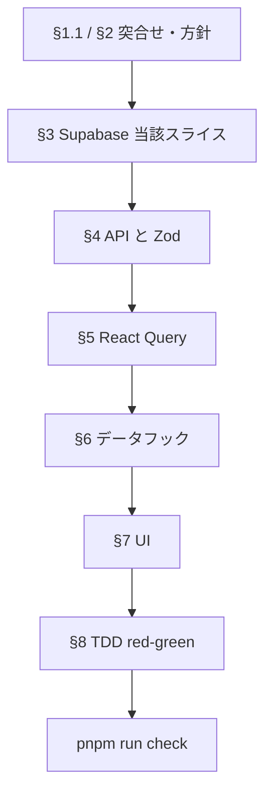
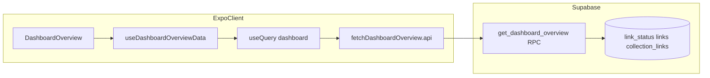

# ダッシュボード概要：ユーザーストーリー別実行プラン

## 仕様の正本

**集計仕様・バックエンド要件・詳細チェックリストの一次情報は** **[dashboard-overview-api.md](./dashboard-overview-api.md)** **である。** **現行マイグレーション／生成型との突合せ（§1.1）**、日付・タイムゾーンの定義、重複計上、ドメイン母集団、RPC 推奨アウトプット、§3.1 の Postgres チェックリストなどは、実装前に必ずそちらを読む。**タイムゾーンは §2 にて案 1（RPC `p_tz` ＋ IANA 暦日集計）を採用済み**とする。

本書は、同ドキュメントを**ユーザーストーリー（垂直スライス）単位**に分解し、**実行順序・DoD・参照 Skills** を一箇所にまとめた補助資料である。詳細の重複は避け、章立ては [dashboard-overview-api.md](./dashboard-overview-api.md) のセクション番号（§）に対応させる。

**進捗サマリ**: **US-A（グラフ／`daily_totals`）は完了**（T1〜T9・2026-03-22 締め）。実装・検証の一次記録は [dashboard-overview-us-a.md](./dashboard-overview-us-a.md)（ストーリーステータス・§5〜§8）。次の垂直スライスは **US-B**。

---

## 開発原則

[AGENTS.md](../../AGENTS.md)・[cursor-rules.mdc](../../.cursor/rules/cursor-rules.mdc) と整合させ、インクリメントごとに次を守る。

### 1. アジャイル式の垂直分割（vertical slicing）

- 各ユーザーストーリーは**レイヤー横断の薄いスライス**として計画する（例: US-A なら「`daily_totals` を返す RPC 範囲 + `api/` + React Query + チャート表示 + 受け入れテスト」までが**一つのインクリメント**）。
- 「DB だけ全部 → API だけ全部」の**水平バッチ**だけにしない。**ユーザー価値が出る単位**で区切る。
- RPC が **`daily_totals` / `daily_by_collection` / `daily_by_domain` を一括**で返す場合（[dashboard-overview-api.md §3.1](./dashboard-overview-api.md) の「複数 RPC 連打しない」と整合）は、スキーマは一括でも、**フロント取り込み・テスト・受け入れの説明は US-A → US-B → US-C の順**で追えるように書く（先にグラフだけ利用可能にする等、スライスできるなら優先）。

### 2. 古典派 TDD（モック最小・red から開始）

- **Red → Green → Refactor**。振る舞いのテストは**最初に失敗（red）**させてから実装する。
- **モックは最小限**: プロセス外の境界（Supabase クライアント等）のみ。振る舞いの検証は実装詳細に依存しない**ソーシャブル**なテストを優先する（[dashboard-overview-api.md §8](./dashboard-overview-api.md) と同趣旨）。

### 3. 静的コード品質

- 各ステップ完了時および PR 前に **`pnpm run check`** を実行し、型・Lint 等を満たす（AGENTS.md の Verify と同じ）。

---

## 参照 Skills・ルール（実装・レビュー時）

[dashboard-overview-api.md §0](./dashboard-overview-api.md) と同一セット。用途の目安を右列に記す。

| 参照先                                                                                             | 用途                                                                                      |
| -------------------------------------------------------------------------------------------------- | ----------------------------------------------------------------------------------------- |
| [native-data-fetching](../../.cursor/skills/native-data-fetching/SKILL.md)                         | React Query、`expo/fetch`、エラー・キャッシュ（**§4〜5**）                                |
| [building-native-ui](../../.cursor/skills/building-native-ui/SKILL.md)                             | ScrollView／safe area／アニメーション（**§7**、RefreshControl）。本リポは NativeWind 併用 |
| [vercel-react-native-skills](../../.cursor/skills/vercel-react-native-skills/SKILL.md)             | リスト・レンダリング・フォールバック（チャート／内訳テーブル）                            |
| [supabase-postgres-best-practices](../../.cursor/skills/supabase-postgres-best-practices/SKILL.md) | クエリ性能・RLS・接続・スキーマ（**§3**）                                                 |
| [cursor-rules.mdc](../../.cursor/rules/cursor-rules.mdc)                                           | Zod、feature/`api/` 集約、TDD（**全層**）                                                 |

Supabase 実装時は、上記 SKILL に加え [.cursor/skills/supabase-postgres-best-practices/references/](../../.cursor/skills/supabase-postgres-best-practices/references/) 以下の個別ルールを、マイグレーション／RPC 設計の前に開くこと（§0 と同じ）。

### ユーザーストーリーと Skills の対応（目安）

| ストーリー                   | 主に参照する Skills                                                         |
| ---------------------------- | --------------------------------------------------------------------------- |
| US-A（グラフ）               | native-data-fetching、building-native-ui、vercel-react-native-skills        |
| US-B / US-C（内訳テーブル）  | 上記に加え supabase-postgres-best-practices（集計・重複計上・ドメイン抽出） |
| US-X（エラー・引っ張り更新） | building-native-ui、native-data-fetching（再フェッチ）                      |

---

## 背景サマリ（詳細は正本へ）

MVP では Growth Dashboard／Activity Log（直近 7 日）でトリアージ実績を可視化し、confidence-driven な体験にする。現状はモック・クライアント仮計算・`useLinks` 件数上限により、集計が信頼しづらい。→ **Supabase 集計 + `api/` + React Query** へ寄せ、モックを撤去する。現状ファイルの列挙は [dashboard-overview-api.md §1](./dashboard-overview-api.md) を参照。

---

## プロダクト上のユーザーストーリー（原文）

[dashboard-overview-api.md](./dashboard-overview-api.md) より。

| 誰として                                           | 何がしたいか                                                                                          | なぜか（価値）                                                                     |
| -------------------------------------------------- | ----------------------------------------------------------------------------------------------------- | ---------------------------------------------------------------------------------- |
| **リンクを保存・トリアージしているユーザー**として | 直近 7 日の「追加したリンク数」と「読了（完了）したリンク数」を、**グラフで正しく**見たい             | 実績を見て「今週どれだけ処理したか」を把握し、**決断疲れを減らす自信**につなげたい |
| 同上                                               | ある日の棒を選んだとき、その日の内訳を**コレクション別**・**ドメイン別**で見たい                      | テーマ／サイトごとの傾向を把握し、次の行動を決めやすくしたい                       |
| 同上                                               | コレクション一覧の「追加／読了」の内訳が、**実際の `link_status` 等に基づく**数字であることを期待する | 一覧とダッシュボードの数字が食い違わない**信頼できるダッシュボード**にしたい       |
| 同上                                               | 通信やサーバが失敗したとき、**何が起きたか分かり、再試行**できる                                      | レジリエンス                                                                       |
| 同上                                               | 画面を**引っ張って更新**し、トリアージ直後の結果がグラフに反映されることを確認したい                  | 操作フィードバック                                                                 |

---

## 実装単位へのマッピング（3 本柱 + 横断）

説明用に **collection_table** / **domain_table** と書く場合があるが、コード上の `tableView` の値は **`"collection"` / `"domain"`** である。

| ID       | ユーザーストーリー（要約）                         | 主な UI / データ                                                                                                                                                                 | 正本の参照                                                |
| -------- | -------------------------------------------------- | -------------------------------------------------------------------------------------------------------------------------------------------------------------------------------- | --------------------------------------------------------- |
| **US-A** | グラフ表示（7 日系列）**— 完了**（T1〜T9）         | [`DashboardWeeklyActivityChart`](../../src/features/links/components/dashboard/DashboardWeeklyActivityChart.tsx)、RPC の `daily_totals`（§3.2）                                  | §2, §3.2, §4〜7 · [us-a.md](./dashboard-overview-us-a.md) |
| **US-B** | collection_table（コレクション別内訳）             | [`DashboardBreakdownSection`](../../src/features/links/components/dashboard/DashboardBreakdownSection.tsx) で `tableView === "collection"`、`daily_by_collection`、§2 の重複計上 | §2 コレクション、§3.2、§6                                 |
| **US-C** | domain_table（ドメイン別内訳）                     | 同セクションで `tableView === "domain"`、`daily_by_domain`、[`extractDomain`](../../src/features/links/utils/urlUtils.ts) と SQL 同値、母集団は `new` / `done` のみ（§2）        | §2, §3.2, §6                                              |
| **US-X** | エラー時の復帰・引っ張り更新・空・アクセシビリティ | [`DashboardOverview`](../../src/features/links/screens/DashboardOverview.tsx)、[`ScreenContainer`](../../src/shared/components/layout/ScreenContainer.tsx) 等                    | §7                                                        |

---

## 作成予定・更新予定のファイル配置

[react-native-expo-architecture.mdc](../../.cursor/rules/react-native-expo-architecture.mdc) の **feature 配下**（`api/`・`hooks/`・`types/`・`testing/` 等）に沿う。以下はダッシュボード概要実装で**新規に置く場所**と**既存を触る場所**の目安である。ファイル名は [dashboard-overview-api.md §4〜8](./dashboard-overview-api.md) の仮称と整合させ、YAGNI に応じて 1 ファイルにまとめてよい。

### フォルダツリー（目安）

```text
supabase/migrations/
  └── <timestamp>_get_dashboard_overview.sql   # 新規: RPC・補助関数・必要なら GRANT（命名はチーム規約に合わせる）

src/features/links/
  ├── api/
  │   ├── fetchDashboardOverview.api.ts          # T4 済: supabase.rpc + Zod parse（§4）
  │   └── …                                      # 既存の各 *.api.ts は変更しない（§5 の invalidate 元フックから参照）
  ├── constants/
  │   └── queryKeys.ts                           # T5 済: `linkQueryKeys.dashboardOverview`、T7 済: `dashboardOverviewPrefix()`（§5）
  ├── hooks/
  │   ├── useDashboardOverviewQuery.ts          # T5 済 + T8: `isPending` / `isFetching` 返却（§5）
  │   ├── useDashboardOverviewData.ts            # T6 済 + T8: `dashboardOverviewPending` / `dashboardOverviewFetching`（§6）
  │   ├── useDashboardChartUi.tsx               # T8 済: `showEmptyWeekHint`（§7）
  │   └── useDashboardOverviewUi.tsx             # US-X 未: エラー UI 等は別ストーリー（§7）
  ├── screens/
  │   └── DashboardOverview.tsx                  # T8 済: スケルトン・再取得 `opacity`；エラー・RefreshControl は US-X（§7）
  ├── types/
  │   ├── dashboard.types.ts                     # 更新の可能性: RPC 返却型・画面用型の追記
  │   └── supabase.types.ts                      # 更新: マイグレーション後の型再生成（§1.1）
  ├── testing/
  │   └── dashboardOverview.fixtures.ts          # T8: pending/fetching デフォルト含む（§8）
  ├── utils/
  │   ├── urlUtils.ts                            # 更新の可能性: extractDomain 自体は既存。SQL 同値テスト用にのみ近傍へテスト追加
  │   └── __tests__/
  │       └── extractDomain.vectors.ts           # 任意・新規: 共有ベクトル（§3.2）。単体テストは urlUtils 近傍でも可
  ├── components/dashboard/
  │   └── …                                      # 更新の可能性: チャート／内訳（既存コンポーネント。大きく増えない限り新規フォルダは作らない）
  └── __tests__/
      ├── api/
      │   └── fetchDashboardOverview.api.test.ts # T4 済: Zod・エラー（§8）
      └── hooks/
          ├── useDashboardOverviewQuery.test.ts  # T5 + T8: queryKey・TZ・staleTime・`isPending`/`isFetching`（§8）
          ├── useDashboardOverviewData.test.ts   # T6 + T8: `daily_totals`・フラグ透過・内訳モック維持（§8）
          └── useDashboardChartUi.test.ts        # T8: 空週ヒント（§8）

src/shared/components/layout/
  └── ScreenContainer.tsx                        # 更新: US-X、`RefreshControl` 用 props（§7）

app/(protected)/(tabs)/(dashboard)/
  └── dashboard.tsx                              # 更新の可能性: `ScreenContainer` に refresh を渡すだけなら軽微
```

### レイヤとフォルダの対応

| レイヤ（正本 §）             | 主なフォルダ・ファイル                                                                                                    |
| ---------------------------- | ------------------------------------------------------------------------------------------------------------------------- |
| Supabase（§3）               | `supabase/migrations/*.sql`                                                                                               |
| API・Zod（§4）               | `src/features/links/api/`                                                                                                 |
| Query キー・取得フック（§5） | `src/features/links/constants/queryKeys.ts`、`src/features/links/hooks/`                                                  |
| データ合成・既存フック（§6） | `src/features/links/hooks/useDashboardOverviewData.ts` 等                                                                 |
| 画面・共通レイアウト（§7）   | `src/features/links/screens/`、`src/shared/components/layout/`                                                            |
| テスト・fixtures（§8）       | `src/features/links/__tests__/api/`、`src/features/links/testing/`、`src/features/links/utils/__tests__/`（ベクトル任意） |

**ルーティング**: 新規ルートファイルは不要（既存 [`dashboard.tsx`](<../../app/(protected)/(tabs)/(dashboard)/dashboard.tsx>) を継続）。**mutation 側**は [dashboard-overview-api.md §5](./dashboard-overview-api.md) の invalidate 一覧にある既存フックを更新するのみで、新規 `api/` ファイルは増やさない。

---

## タスク分解（チェックリスト）

各スライスで **red → green → refactor** と **`pnpm run check`** を通してから次へ進める。

### US-A：グラフ（`daily_totals`）

- [x] Supabase: RPC `get_dashboard_overview`（直近 7 日の `daily_totals`；追加日＝`link_status.created_at`、読了＝`read_at`（[§2](./dashboard-overview-api.md)）；`link_status` 用インデックス 2 本）— **T1〜T3 完了**（検証: [dashboard-overview-us-a.md](./dashboard-overview-us-a.md) §5、実装状況表: [dashboard-overview-api.md](./dashboard-overview-api.md) §3.2 付近）
- [ ] Supabase: 集計クエリの `EXPLAIN (ANALYZE, BUFFERS)` とプラン見直し（[§3.1](./dashboard-overview-api.md#31-カテゴリ別チェックリストskill-準拠)、データ量に応じて実施）
- [x] API: [`fetchDashboardOverview.api.ts`](../../src/features/links/api/fetchDashboardOverview.api.ts) で RPC + Zod（[§4](./dashboard-overview-api.md)）— **T4 完了**（検証: [dashboard-overview-us-a.md §5](./dashboard-overview-us-a.md#5-実装済みt1t9サマリ)）
- [x] React Query（T5）: [`linkQueryKeys.dashboardOverview`](../../src/features/links/constants/queryKeys.ts)、[`useDashboardOverviewQuery`](../../src/features/links/hooks/useDashboardOverviewQuery.ts)（[§5](./dashboard-overview-api.md)）— **完了**（検証: [dashboard-overview-us-a.md §5](./dashboard-overview-us-a.md#5-実装済みt1t9サマリ)）
- [x] React Query（T7）: 各 mutation から `invalidate` 連携（`linkQueryKeys.dashboardOverviewPrefix()`、[§5](./dashboard-overview-api.md)）— **完了**（検証: [dashboard-overview-us-a.md §5・T7](./dashboard-overview-us-a.md#5-実装済みt1t9サマリ)）
- [x] **T6**: [`useDashboardOverviewData`](../../src/features/links/hooks/useDashboardOverviewData.ts) の **チャート** `addedByDay` / `readByDay` を [`useDashboardOverviewQuery`](../../src/features/links/hooks/useDashboardOverviewQuery.ts) の `daily_totals` に接続（テスト: [`useDashboardOverviewData.test.ts`](../../src/features/links/__tests__/hooks/useDashboardOverviewData.test.ts)）。コレクション／ドメインの日別行列は **引き続き** [`mockAddedByDay` / `mockReadByDay`](../../src/features/links/utils/dashboardStats.ts)（**US-B/C** で除去）
- [ ] `useDashboardOverviewData` から **内訳用** `mockAddedByDay` / `mockReadByDay` を除去（[§6](./dashboard-overview-api.md)・US-B/C 完了時）
- [x] UI（T8）: ダッシュクエリの loading 合成（`isPending` スケルトン・`isFetching` 時チャート `opacity`）・7 日すべて 0 のチャート空コピー（`chart_week_empty_hint`）（[§7](./dashboard-overview-api.md)、[dashboard-overview-us-a.md §5・T8](./dashboard-overview-us-a.md#5-実装済みt1t9サマリ)）
- [x] テスト（API 層）: [`fetchDashboardOverview.api.test.ts`](../../src/features/links/__tests__/api/fetchDashboardOverview.api.test.ts)（[§8](./dashboard-overview-api.md)）— **T4 済**
- [x] テスト（フック・T5）: [`useDashboardOverviewQuery.test.ts`](../../src/features/links/__tests__/hooks/useDashboardOverviewQuery.test.ts)（[§8](./dashboard-overview-api.md)）
- [x] テスト（T6・T8）: [`useDashboardOverviewData.test.ts`](../../src/features/links/__tests__/hooks/useDashboardOverviewData.test.ts)（[§8](./dashboard-overview-api.md)）。[`dashboardOverview.fixtures.ts`](../../src/features/links/testing/dashboardOverview.fixtures.ts) に T8 で `dashboardOverviewPending` / `dashboardOverviewFetching` を追加
- [x] テスト（T8・チャート UI）: [`useDashboardChartUi.test.ts`](../../src/features/links/__tests__/hooks/useDashboardChartUi.test.ts)（[§8](./dashboard-overview-api.md)）
- [x] **T9（品質ゲート）**: `pnpm test` / `pnpm run check` 通過・ログ確認 — [dashboard-overview-us-a.md §6 T9](./dashboard-overview-us-a.md#t9--回帰テスト品質ゲート)。**US-A ストーリー（グラフ系列）として完了**（`EXPLAIN` は §3.1 フォローアップ・US-A DoD 外）

### US-B：collection_table（`daily_by_collection`）

- [ ] Supabase: `daily_by_collection`；**内訳のみ**複数コレクションで重複計上、**チャートの日次合計はリンク一意**（[§2](./dashboard-overview-api.md)）
- [ ] API / Zod: コレクション行列
- [ ] データ層: `collectionAddedStatsByDay` / `collectionReadStatsByDay` をサーバ由来に；仮 `readCount`（`Math.floor(n * 0.45)` 等）削除（[§6](./dashboard-overview-api.md)）
- [ ] UI: 選択日の行、`collectionsLoading` とダッシュ `loading` の合成（[§6](./dashboard-overview-api.md)）
- [ ] テスト・`pnpm run check`

### US-C：domain_table（`daily_by_domain`）

- [ ] Supabase: ドメイン抽出を SQL 化しアプリと同値；対象は `new` / `done` のみ（[§2](./dashboard-overview-api.md)、[§3.2](./dashboard-overview-api.md)）
- [ ] データ層: `buildDomainStatsFromLinks` 削除またはフォールバック廃止（[§6](./dashboard-overview-api.md)）
- [ ] UI: `tableView === "domain"` の行・空ラベル
- [ ] テスト・`pnpm run check`

### US-X：横断（レジリエンス・更新）

- [ ] エラー UI・再試行（[§7](./dashboard-overview-api.md) 項 1）
- [ ] `RefreshControl`（`ScreenContainer` の props 拡張等、[§7](./dashboard-overview-api.md) 項 2）
- [ ] 空データコピー（[§7](./dashboard-overview-api.md) 項 3）
- [ ] エラー／空のアクセシビリティラベル（[§7](./dashboard-overview-api.md) 項 4）
- [ ] リスト仮想化は行数が増えた場合のみ検討（YAGNI、[§7](./dashboard-overview-api.md) 項 5）

---

## 実行手順

### 第一義：垂直スライス

US-A → US-B → US-C の順で、各スライス内で **§1.1（現行スキーマ突合せ）→ §2（プロダクト方針・TZ）の該当範囲 → Supabase（§3）→ API（§4）→ React Query（§5）→ フック／画面（§6〜7）→ テスト（§8）→ `pnpm run check`** までを完了可能な塊として進める。

### 第二義：層の安全順（レビュー・一括 RPC 時）

[dashboard-overview-api.md §10](./dashboard-overview-api.md) のとおり、**スキーマ突合せ（§1.1）とプロダクト方針（§2）の確定** → DB/RPC → API → … の順は、**各スライス内**または**一括マイグレーション**のレビューで参照する。



一括 RPC で `daily_totals` + `daily_by_collection` + `daily_by_domain` を返す場合も、**フロントの取り込みと受け入れはストーリー順（A→B→C）**で追跡できるようにする。

---

## 完了定義（DoD）

各インクリメントに共通:

- 当該範囲で **古典派 TDD（red を経由）** を満たす。
- **`pnpm run check`** が通る。

ストーリー別の受け入れ基準（例）:

| ID   | 受け入れ基準（要約）                                                                                                 |
| ---- | -------------------------------------------------------------------------------------------------------------------- |
| US-A | 7 日系列がモックなしで RPC / `daily_totals` と一致する — **完了**（T1〜T9・[us-a.md](./dashboard-overview-us-a.md)） |
| US-B | コレクション内訳の重複計上・日次合計の扱いが [§2](./dashboard-overview-api.md) 通り                                  |
| US-C | ドメイン母集団が `new` / `done` のみで、抽出が `extractDomain` と同値                                                |
| US-X | エラー時に再試行でき、引っ張り更新でクエリが無効化／再取得される                                                     |

---

## データフロー（実装後イメージ）

[dashboard-overview-api.md §9](./dashboard-overview-api.md) と同じ。



---

## 正本セクション対応表

| 本書の主題                      | dashboard-overview-api.md                                                 |
| ------------------------------- | ------------------------------------------------------------------------- |
| 作成予定ファイルのフォルダ構成  | 本書「作成予定・更新予定のファイル配置」のみ（正本は層ごと §4〜8 を参照） |
| 開発原則・Skills                | §0、本文冒頭                                                              |
| 背景・現状コード                | §1                                                                        |
| 日付・重複・ドメイン母集団      | §2                                                                        |
| RPC・インデックス・RLS          | §3                                                                        |
| `api/`・Zod                     | §4                                                                        |
| Query キー・invalidate          | §5                                                                        |
| `useDashboardOverviewData` 置換 | §6                                                                        |
| エラー・Refresh・空             | §7                                                                        |
| テスト方針                      | §8                                                                        |
| データフロー                    | §9                                                                        |
| 層の安全順                      | §10                                                                       |
